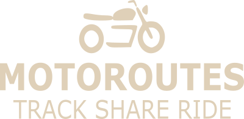

# MotoRoutes
## Track Share Ride

Native React project to track motorcycle routes and share with friends

### MVP Features
* List routes with basic ride data and linking to notes, map and videos
* Basic CRUD functionality for routes
* User Authentication
* Sorting and filtering of routes

### Stretch Features
* Contact ("friends") management
* Set routes to private, shared with friends and public
* Basic chat functionality for trip planning
* Other trip planning functionality such as gear lists, where to stay, etc

### Running Locally (Android only so far)
* Clone repo, navigate into the project directory within your terminal
* In your terminal ```npm install``` to install dependencies
* In your terminal ```npm run start``` to start app
* You will need Expo Go installed on your Android device.  Scan QR code in your terminal to see app on your device.